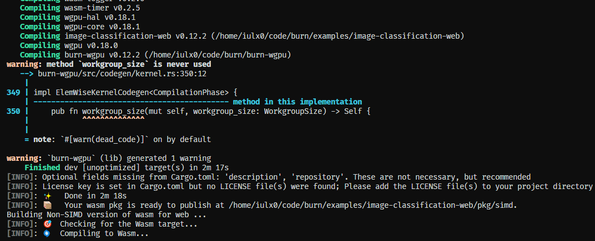
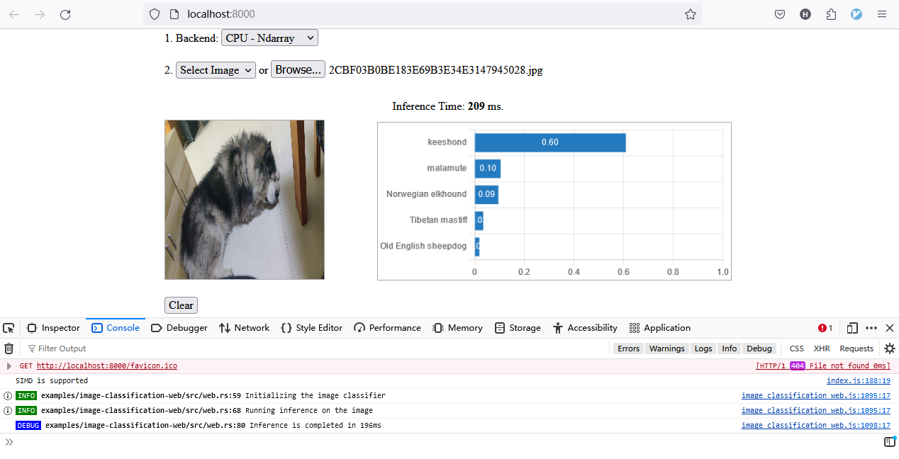
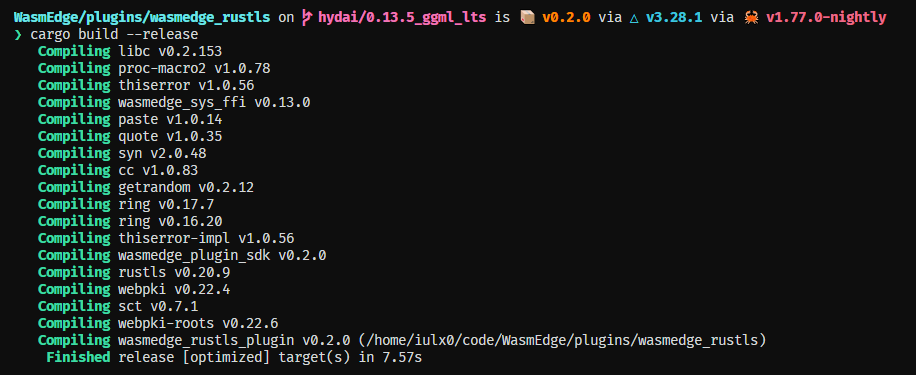
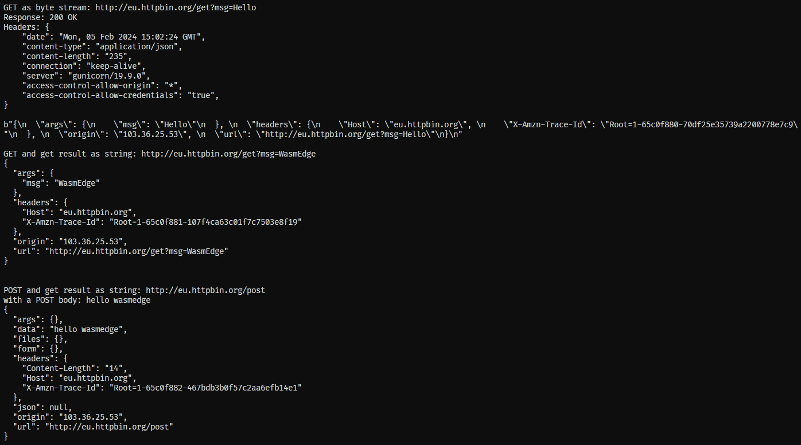

# LFX-Mentorship 2024-01 Pre-test

Applied Issue [#3172](https://github.com/WasmEdge/WasmEdge/issues/3172)

Using branch `hydai/0.13.5_ggml_lts` for [rustls plugin](#2-build-and-execute-rustls-plugin)

- [LFX-Mentorship 2024-01 Pre-test](#lfx-mentorship-2024-01-pre-test)
  - [1. Framework Execution](#1-framework-execution)
    - [Compile](#compile)
    - [Run server](#run-server)
  - [2. Build and Execute `rustls` plugin](#2-build-and-execute-rustls-plugin)
    - [Install WasmEdge](#install-wasmedge)
    - [Run and test demo with plugin](#run-and-test-demo-with-plugin)


## 1. Framework Execution

### Compile

- Compile Burn's `image-classification-web` example

  ```sh
  git clone https://github.com/tracel-ai/burn -b release/0.12
  cd examples/image-classification-web/
  rustup target add wasm32-unknown-unknown
  cargo install wasm-pack
  sh build-for-web.sh
  ```

  

### Run server

- Start a simple http server and serve

  ```sh
  sh run-server.sh
  ```

  

## 2. Build and Execute `rustls` plugin

### Install WasmEdge

- Install WasmEdge
  
  ```sh
  # install WasmEdge
  curl -sSf https://raw.githubusercontent.com/WasmEdge/WasmEdge/master/utils/install.sh | bash
  source $HOME/.wasmedge/env
  ```
  
- Build plugin and install
  
  ```
  # clone source code and build `rustls` plugin
  git clone https://github.com/WasmEdge/WasmEdge.git -b hydai/0.13.5_ggml_lts
  cd WasmEdge/plugins/wasmedge_rustls
  cargo build --release

  # copy target to plugin path
  cp target/release/libwasmedge_rustls.so ~/.wasmedge/plugin
  ```

  

### Run and test demo with plugin

  ```sh
  # clone demo and build
  git clone https://github.com/WasmEdge/wasmedge_hyper_demo
  cd wasmedge_hyper_demo/client
  rustup target add wasm32-wasi
  cargo build --target wasm32-wasi --release

  # run target with wasmedge
  wasmedge run ./target/wasm32-wasi/release/wasmedge_hyper_client.wasm
  ```

  
